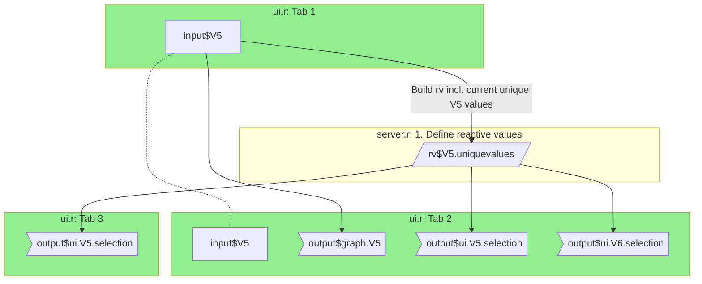

[Reactive Graphs](https://mastering-shiny.org/reactive-graph.html) können mit einem [GitLab-Markdown Dokument](https://docs.gitlab.com/ee/user/markdown.html) erstellt werden. In diesem Dokument kann ein [Mermaid](https://mermaid-js.github.io/mermaid/#/) Code-Chunk verwendet werden. Dies bietet die Möglichkeit Diagramme mittels Syntax zu erzeugen. Zum Test der Syntax kann der [Mermaid Live Editor](https://mermaid-js.github.io/mermaid-live-editor) verwendet werden.

Hier die Vorlage für den Code zur Erzeugung von Reactive Graphs und dem daraus erzeugten Graphen:

```
    ```mermaid
    graph TB
    subgraph Tab1 ["ui.r: Tab 1"]
        A[input$V5]
    end

    subgraph Server.1 ["server.r: 1. Define reactive values"]
        A --> |Build rv incl. current unique V5 values| B[/rv$V5.uniquevalues/]
    end

    subgraph Tab2 ["ui.r: Tab 2"]
        A -.- A2[input$V5]

        A --> E>output$graph.V5]
        B --> C>output$ui.V5.selection]
        B --> D>output$ui.V6.selection]
    end

    subgraph Tab3 ["ui.r: Tab 3"]
        B --> F>output$ui.V5.selection]
    end

    classDef input fill:lightgreen;
        class Tab1 input
        class Tab2 input
        class Tab3 input
    ```   
```


